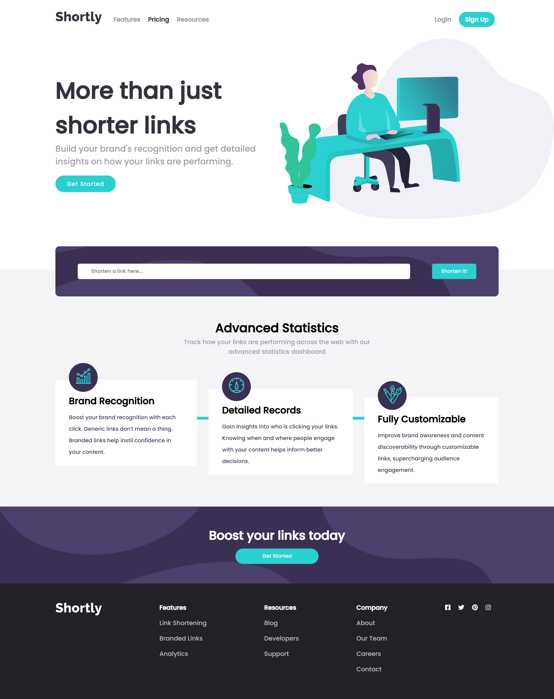
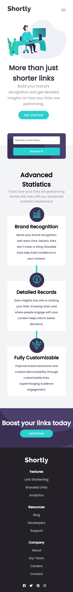

# Frontend Mentor - Shortly URL shortening API Challenge solution

This is a solution to the [Shortly URL shortening API Challenge challenge on Frontend Mentor](https://www.frontendmentor.io/challenges/url-shortening-api-landing-page-2ce3ob-G). Frontend Mentor challenges help you improve your coding skills by building realistic projects. 

## Table of contents

- [Overview](#overview)
  - [The challenge](#the-challenge)
  - [Screenshot](#screenshot)
  - [Links](#links)
- [My process](#my-process)
  - [Built with](#built-with)
  - [What I learned](#what-i-learned)
  - [Continued development](#continued-development)
  - [Useful resources](#useful-resources)
- [Author](#author)
- [Acknowledgments](#acknowledgments)

## Overview

### The challenge

Users should be able to:

- View the optimal layout for the site depending on their device's screen size
- Shorten any valid URL
- See a list of their shortened links, even after refreshing the browser
- Copy the shortened link to their clipboard in a single click
- Receive an error message when the `form` is submitted if:
  - The `input` field is empty

### Screenshot

### Links

- Solution URL: [https://www.frontendmentor.io/solutions/url-shortening-application-with-vuejs-x53LuViP-e](https://www.frontendmentor.io/solutions/url-shortening-application-with-vuejs-x53LuViP-e)
- Live Site URL: [https://url-ly.netlify.app/](https://url-ly.netlify.app/)

## My process

### Built with

- Semantic HTML5 markup
- CSS custom properties
- Flexbox
- CSS Grid
- Mobile-first workflow
- [Vue](https://vuejs.org/) - JS library
- [Vuex](https://https://vuex.vuejs.org/) - Vue State Management
- [Local Storage]- For making shortened link persistent on the user device.

### What I learned

I learnt how to use Local storage and the use of the unshift Js Method.

### Continued development

Fix the illustration image to look like the one in the design

## Author

- Website - [Oluwakemi Omoyeni](https://captressketh.netlify.app/)
- Frontend Mentor - [@Captressketh001](https://www.frontendmentor.io/profile/Captressketh001)

## Acknowledgments

- [@Boluwatife2904](https://www.frontendmentor.io/profile/Boluwatife2904) and Tobi-davies  - Their work was an inspiration and a guide for me.
